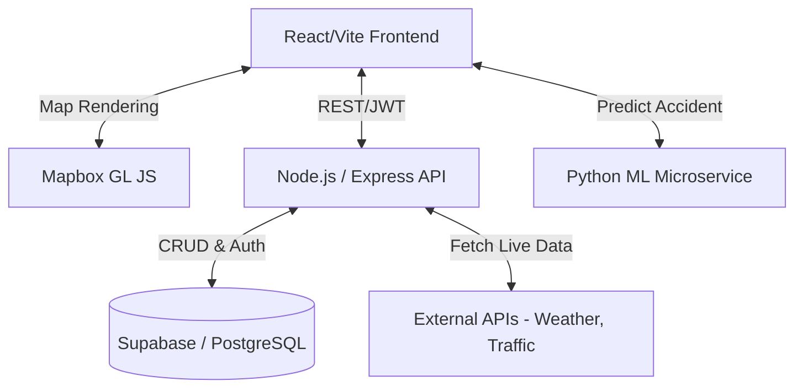

<div align="center">
  
  
  <br />
  <br />

  # 🛡️ Safe Trip - Smart Driving & Safety Application
  
  **AI-Powered Real-Time Hazard Detection & Navigation System**
  
  [Live Demo](#) · [Report Bug](#) · [Request Feature](#)

  <p align="center">
    
    
    
    
    
  </p>
</div>

---

## 📌 Project Overview

### Problem Statement
Road accidents claim millions of lives globally, often caused by unforeseen hazards, sudden weather changes, and unpredictable traffic congestion. Traditional navigation apps focus purely on routing, lacking proactive, real-time safety measures tailored to the current driving context.

### Why This Was Built
**Safe Trip** was engineered to transition from *passive navigation* to *proactive safety*. By aggregating real-time external data (traffic, weather) and applying Machine Learning (ML), the application predicts accident probabilities and actively warns drivers of potential hazards before they occur.

### Real-World Impact & Target Users
- **Commuters & Long-distance Drivers:** Provides real-time alerts, safer routing, and driving analytics.
- **Logistics & Fleet Management:** Enables monitoring of driver safety scores and risk exposure.
- **Community:** Empowers users to report localized road hazards (potholes, accidents), creating a safer driving ecosystem.

### Core Objectives & Business Value
1. **Reduce Accidents:** By leveraging an ML pipeline that calculates safety scores based on speed, weather, and traffic.
2. **Community Driven Safety:** Crowdsourced hazard reporting dynamically alters route risk profiles.
3. **Enterprise Scalability:** Built on a microservices architecture, decoupled frontend, backend, and Python ML service.

---

## 🏗 System Architecture

Safe Trip employs a modern decoupled microservices architecture to ensure scalability and high availability.



### Module Interactions
1. **Frontend (Client):** Renders the 3D interactive map, tracks GPS coordinates, calculates speed, and manages the UI.
2. **Node.js Backend:** Acts as the API gateway for fetching normalized weather and traffic data. Secures endpoints with Supabase JWT validation.
3. **Python ML Service:** Consumes speed, weather, time, and traffic data to output a real-time accident probability score.
4. **Supabase (DB & Auth):** Manages user identities securely and persists user-reported hazards and trip history.

---

## ⚙️ Development Methodology

We adopted an **Agile Methodology** to ensure rapid iteration and continuous integration:
- **Sprint Planning:** 1-week sprints focusing sequentially on UI/UX, Core Mapping, Backend APIs, ML Integration, and Polish.
- **Iterative Feedback:** Early prototypes were tested for GPS accuracy and battery consumption, leading to optimized geolocation polling mechanisms.
- **Challenges Overcome:** Synchronizing state between React's render cycle and Mapbox's WebGL context required careful management of refs and debounced events to maintain a 60fps experience.

---

## ✨ Features Breakdown

### 1. AI-Powered Safety Score (ML Prediction)
- **Purpose:** Calculates real-time accident probability.
- **Implementation:** A Python microservice running a Scikit-Learn Random Forest model evaluates the user's current speed against environmental variables (rain, fog, heavy traffic) and returns a dynamic safety score.

### 2. Live 3D Mapping & Navigation
- **Purpose:** Context-aware routing and visualization.
- **Implementation:** Integrates Mapbox GL JS with custom 3D building layers, night/day modes, and real-time traffic congestion layers.

### 3. Crowdsourced Hazard Reporting
- **Purpose:** Real-time, localized alerts.
- **Implementation:** Users can drop pins on the map to report accidents, road closures, or bad weather. These are instantly saved to Supabase and broadcasted to other drivers in the vicinity.

### 4. Trip Summary & Analytics
- **Purpose:** Post-drive evaluation.
- **Implementation:** Tracks max speed, average speed, distance, and alerts encountered. Saves the trip log to the database for historical driver scoring.

---

## 🛠 Tech Stack

### Frontend
- **React.js (Vite):** Blazing fast builds and optimal component rendering.
- **Tailwind CSS & Shadcn UI:** For a highly polished, responsive, and accessible UI.
- **Mapbox GL JS:** High-performance vector maps and 3D rendering.
- **Zustand:** Lightweight global state management.

### Backend
- **Node.js & Express:** Highly scalable, event-driven backend.
- **Supabase:** PostgreSQL database and Auth provider (JWT).
- **RESTful APIs:** Clean architecture for weather, traffic, and alert endpoints.

### Machine Learning
- **Python:** Dedicated microservice environment.
- **Scikit-Learn:** Model training and inference.
- **Flask / FastAPI:** Serving the prediction model to the frontend/backend.

### Infrastructure & Deployment
- **Frontend Hosting:** Vercel (Edge network optimization).
- **Backend Hosting:** Render (Auto-scaling Node.js and Python environments).

---

## 📂 Folder Structure

```text
📦 safe-trip-smart-driving-safety-application
 ┣ 📂 frontend/          # React + Vite application
 ┃ ┣ 📂 src/
 ┃ ┃ ┣ 📂 components/    # Reusable UI elements (HUD, Widgets, Modals)
 ┃ ┃ ┣ 📂 hooks/         # Custom React Hooks (Auth, Geolocation, APIs)
 ┃ ┃ ┣ 📂 pages/         # Application Views (Dashboard, Map, Profile)
 ┃ ┃ ┗ 📂 lib/           # Utility functions and configurations
 ┣ 📂 backend/           # Node.js Express API
 ┃ ┣ 📂 routes/          # API Route Definitions
 ┃ ┣ 📂 middleware/      # JWT Validation & Security
 ┃ ┗ 📂 utils/           # External API integrations
 ┗ 📂 ml-service/        # Python ML Prediction Service
   ┣ 📜 app.py           # ML API Entry Point
   ┗ 📜 train_model.py   # Script for generating the predictive model
```

---

## 🔄 Application Workflow

1. **Authentication Flow:** User signs up/logs in via Supabase. JWT tokens are securely stored.
2. **Dashboard Initialization:** GPS initializes; the app queries the backend for weather and traffic within a 20km radius.
3. **Navigation & Driving Flow:** 
   - User inputs a destination. Mapbox calculates the route.
   - The ML service continuously polls speed + environment to update the "AI Safety Score".
   - If a hazard is approached, visual and audio alerts are triggered.
4. **Hazard Reporting Flow:** User clicks "Report", selects hazard type. Data is pushed to Supabase and immediately rendered for nearby drivers.
5. **End Trip Flow:** Trip statistics (distance, avg speed, alerts) are compiled and saved to the user's profile.

---

## 📊 Engineering Decisions

- **Why Mapbox over Google Maps?** Mapbox provides superior customization for 3D buildings, custom markers, and granular control over map layers (like injecting a traffic layer natively), crucial for a driving app.
- **Decoupled ML Service:** By separating the Python ML service from the Node.js backend, we allowed the ML model to scale independently and utilized Python's rich data-science ecosystem.
- **Performance Optimizations:** 
  - GPS updates are throttled using Haversine distance formulas to prevent unnecessary React re-renders.
  - Mapbox `requestAnimationFrame` is used to debounce map bearing changes, maintaining a fluid 60fps UI.
- **Security:** Strict CORS policies ensure only our Vercel frontend can access the Render backend. All API endpoints are protected via Supabase JWT validation.

---

## 🧪 Testing & Validation

- **Geolocation Testing:** Simulated routes using browser dev tools to validate speed calculations and boundary crossing for alerts.
- **Performance:** Achieved 90+ Lighthouse scores. Heavy map operations are offloaded to WebGL.
- **Responsiveness:** Mobile-first design ensures the UI scales perfectly for users mounting their phones on vehicle dashboards.

---

## 🏆 Achievements

- Successfully integrated a **tri-architecture system** (React, Node, Python) with zero-latency critical data delivery.
- Implemented a custom ML model that accurately reflects driving risk based on real-world synthetic parameters.

---

## 🚀 Future Enhancements

- **Computer Vision (Dashcam):** Integration with the phone's camera to detect lane drifting and driver drowsiness in real-time.
- **Offline Maps:** Caching Mapbox tiles and localized hazard data for network dead zones.
- **Fleet Analytics Dashboard:** A dedicated web portal for logistics companies to monitor their drivers' aggregate safety scores.

<br />

<div align="center">
  <i>Built with 🏎️💨 by VARA committed to road safety.</i>
</div>
